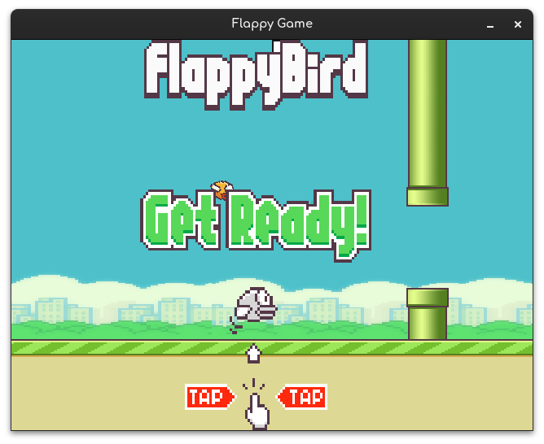

# Flappy
Catchy Flappy Bird-style game demo using Pygame. Stay tuned for upcoming features!

# Flappy Demo Game



Welcome to the Flappy Demo Game repository! This is a simple Flappy Bird-style game created using the Pygame library. The purpose of this project is to demonstrate game development with Python.

## About

The Flappy Demo Game is a basic implementation of the popular Flappy Bird game. It's intended to showcase how a simple game can be developed using the Pygame library. The game features a player-controlled bird that must navigate through a series of pipes. The player can make the bird flap its wings to gain altitude and avoid obstacles.

## Features

- Classic Flappy Bird gameplay
- Player-controlled bird
- Pipe obstacles
- Score tracking
- Pause & Continuos of game.

## Future Plans

I plan to make improvements and add features to this project in the future. Some of the potential enhancements include:

- Online multiplayer functionality
- Enhanced graphics and sound effects
- Customizable characters and themes
- Cross-platform support

## Requirements

To run the Flappy Demo Game, you need the following software:

- Python 3.10 or above
- Pygame 2.5.2

## Getting Started

1. Clone this repository to your local machine:

   ```bash
   git clone https://github.com/your-username/flappy-demo-game.git
   ```
> Note I had also added a ELF file for the linux, if you are a window user.
> Installe all the requirement using pip. and aditional intall the pyinstaller and run this below command over your terminal.
> To get EXE file for window. If any problem occure fell free to submit it in a issue section.
```cmd
navigate to this folder> pyinstaller --onefile flappy.py
```
